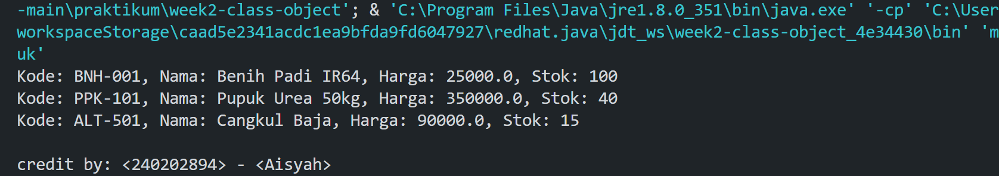

# Laporan Praktikum Minggu 2
Topik: Class dan Object (Produk Pertanian)
## Identitas
- Nama  : Aisyah Intan Nurjannah
- NIM   : 240202894
- Kelas : 3IKRB

---

## Tujuan
- Mahasiswa mampu menjelaskan konsep class, object, atribut, dan method dalam OOP.
- Mahasiswa mampu menerapkan access modifier dan enkapsulasi dalam pembuatan class.
- Mahasiswa mampu mengimplementasikan class Produk pertanian dengan atribut dan method yang sesuai.
- Mahasiswa mampu mendemonstrasikan instansiasi object serta menampilkan data produk pertanian di console.
- Mahasiswa mampu menyusun laporan praktikum dengan bukti kode, hasil eksekusi, dan analisis sederhana.
---

## Dasar Teori
Class adalah blueprint atau cetak biru dari sebuah objek. Objek merupakan instansiasi dari class yang berisi atribut (data) dan method (perilaku). Dalam OOP, enkapsulasi dilakukan dengan menyembunyikan data menggunakan access modifier (public, private, protected) serta menyediakan akses melalui getter dan setter.

Dalam konteks Agri-POS, produk pertanian seperti benih, pupuk, dan alat pertanian dapat direpresentasikan sebagai objek yang memiliki atribut nama, harga, dan stok. Dengan menggunakan class, setiap produk dapat dibuat, dikelola, dan dimanipulasi secara lebih terstruktur.


---

## Langkah Praktikum
```
1. Buat class produk
   Buat file Produk.java pada package model. Tambahkan atribut: kode, nama, harga, dan stok. Gunakan enkapsulasi dengan menjadikan atribut bersifat private. Buat getter dan setter untuk masing-masing atribut.
2. Buat Class CreditBy
   Buat file CreditBy.java pada package util. 
  Tambahkan method statis untuk menampilkan identitas mahasiswa dengan format:  
   credit by: <NIM> - <Nama>.

3. Buat Objek Produk dan Menampilkan Credit
   Buat file MainProduk.java.
Instansiasi minimal tiga objek produk: Benih Padi, Pupuk Urea, dan satu produk alat pertanian.
Tampilkan informasi produk melalui method getter.
Panggil CreditBy.print("", "") di akhir main untuk menampilkan identitas mahasiswa.

4. Commit dan Push
   Commit dengan pesan: week2-class-object.
```
---

## Kode Program
1.Produk.java
```java
package main.java.com.upb.agripos.model;

public class Produk {
    // Atribut private
    private String kode;
    private String nama;
    private double harga;
    private int stok;

    // Constructor untuk inisialisasi produk
    public Produk(String kode, String nama, double harga, int stok) {
        this.kode = kode;
        this.nama = nama;
        this.harga = harga;
        this.stok = stok;
    }

    // Getter dan Setter untuk kode
    public String getKode() {
        return kode;
    }

    public void setKode(String kode) {
        this.kode = kode;
    }

    // Getter dan Setter untuk nama
    public String getNama() {
        return nama;
    }

    public void setNama(String nama) {
        this.nama = nama;
    }

    // Getter dan Setter untuk harga
    public double getHarga() {
        return harga;
    }

    public void setHarga(double harga) {
        this.harga = harga;
    }

    // Getter dan Setter untuk stok
    public int getStok() {
        return stok;
    }

    public void setStok(int stok) {
        this.stok = stok;
    }

    // Override toString untuk menampilkan informasi produk
    @Override
    public String toString() {
        return "Produk [Kode=" + kode + ", Nama=" + nama + ", Harga=" + harga + ", Stok=" + stok + "]";
    }
}


2.CreditBy.java
package main.java.com.upb.agripos.util;


public class CreditBy {
    public static void print(String nim, String nama) {
        System.out.println("\ncredit by: " + nim + " - " + nama);
    }
}

3.MainProduk.java
package main.java.com.upb.agripos;

import main.java.com.upb.agripos.model.Produk;
import main.java.com.upb.agripos.util.CreditBy;

public class MainProduk {
    public static void main(String[] args) {
        Produk p1 = new Produk("BNH-001", "Benih Padi IR64", 25000, 100);
        Produk p2 = new Produk("PPK-101", "Pupuk Urea 50kg", 350000, 40);
        Produk p3 = new Produk("ALT-501", "Cangkul Baja", 90000, 15);

        System.out.println("Kode: " + p1.getKode() + ", Nama: " + p1.getNama() + ", Harga: " + p1.getHarga() + ", Stok: " + p1.getStok());
        System.out.println("Kode: " + p2.getKode() + ", Nama: " + p2.getNama() + ", Harga: " + p2.getHarga() + ", Stok: " + p2.getStok());
        System.out.println("Kode: " + p3.getKode() + ", Nama: " + p3.getNama() + ", Harga: " + p3.getHarga() + ", Stok: " + p3.getStok());

        // Tampilkan identitas mahasiswa
        CreditBy.print("<240202894>", "<Aisyah>");
    }
}


## Hasil Eksekusi
(
(Sertakan screenshot hasil eksekusi program)  

)
---

## Analisis
---
Cara kerja kode:
Program membuat tiga objek dari class Produk yang masing-masing memiliki atribut dan method. Informasi produk ditampilkan melalui method tampilkanInfo().
Di akhir program, method CreditBy.print() dipanggil untuk menampilkan identitas pembuat program.

Perbedaan dengan minggu sebelumnya:
Minggu sebelumnya menggunakan pendekatan prosedural, sedangkan minggu ini menggunakan pendekatan Object-Oriented Programming (OOP) dengan class, object, atribut, dan method yang lebih terstruktur.
---


## Kesimpulan
---
Dalam pemrograman berbasis objek, class berfungsi sebagai cetak biru yang menentukan atribut dan perilaku objek, sementara objek adalah instansiasi nyata dari class tersebut. Konsep enkapsulasi diterapkan melalui deklarasi atribut sebagai private dan penggunaan getter serta setter untuk mengontrol akses terhadap data, sehingga integritas informasi tetap terjaga dan sistem menjadi lebih aman dari manipulasi sembarangan. Dengan menerapkan struktur OOP pada aplikasi seperti Agri-POS, entitas nyata seperti Produk pertanian dapat dimodelkan secara terstruktur dan terstandarisasi, memungkinkan pengembangan fitur lanjutan seperti manajemen inventori, transaksi terintegrasi, hingga sistem laporan otomatis. Hal ini membuktikan bahwa penerapan class, enkapsulasi, dan pengelolaan atribut secara tepat tidak hanya meningkatkan efisiensi pengembangan perangkat lunak, tetapi juga menjamin skalabilitas dan kualitas sistem dalam jangka panjang.


## Quiz

1. Mengapa atribut sebaiknya dideklarasikan sebagai private dalam class?
  Atribut sebaiknya dideklarasikan sebagai private untuk menjaga keamanan dan konsistensi data. Dengan membatasi akses langsung dari luar class, atribut terlindungi dari manipulasi yang tidak valid atau tidak sesuai dengan aturan logika sistem.  

2. Apa fungsi getter dan setter dalam enkapsulasi?
   Getter digunakan untuk mengambil nilai atribut secara aman, sedangkan setter digunakan untuk mengubah nilai atribut dengan validasi tertentu. Keduanya memastikan akses data tetap terkontrol dan sesuai dengan aturan yang ditentukan dalam class. 

3. Bagaimana cara class Produk mendukung pengembangan aplikasi POS yang lebih kompleks?  
   Class Produk memungkinkan setiap item pertanian direpresentasikan sebagai objek dengan struktur yang terstandar. Hal ini mempermudah integrasi fitur seperti manajemen stok, perhitungan harga otomatis, diskon, dan laporan penjualan, sehingga aplikasi POS dapat dikembangkan secara modular dan scalable.
